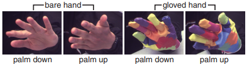
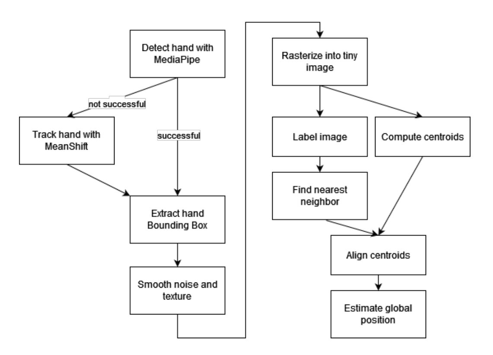
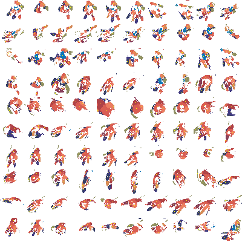
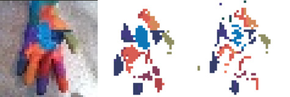
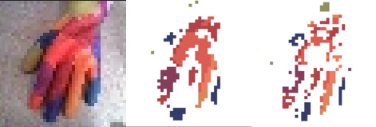

# Implementation of Marker-Based Hand Tracking Method

This repository contains the implementation of the second method described in the Bachelor's thesis **"Evaluating Marker-Based Hand Tracking Algorithms in Augmented Reality"**. The thesis focuses on implementing and evaluating the hand tracking method proposed by **R. Y. Wang and J. Popovič** in their paper:

> **"Real-Time Hand-Tracking with a Color Glove"**  
> ACM Trans. Graph. 28.3 (July 2009).  
> ISSN: 0730-0301. DOI: [10.1145/1531326.1531369](https://doi.org/10.1145/1531326.1531369)  

This repository includes experiments, data handling procedures, and evaluation metrics used to study the effectiveness and limitations of marker-based hand tracking.

---

## Overview

The project explores the efficacy of marker-based hand tracking in augmented reality (AR) applications. Using traditional computer vision techniques, the thesis evaluates the feasibility of using markers as a reliable solution for hand tracking in scenarios requiring high precision.

---

## Dataset

The dataset comprises synthetic and real-world hand-tracking data generated or captured specifically for this thesis. Markers of varying sizes, shapes, and complexities were tested under controlled lighting conditions. The dataset was carefully labeled to provide high-quality ground truth data for evaluation.

### **Dataset Examples**  
Below are examples of the dataset and the labeling process:

- Overview of hand poses in the dataset:  
  

- Example of labeled samples:  
    
  
